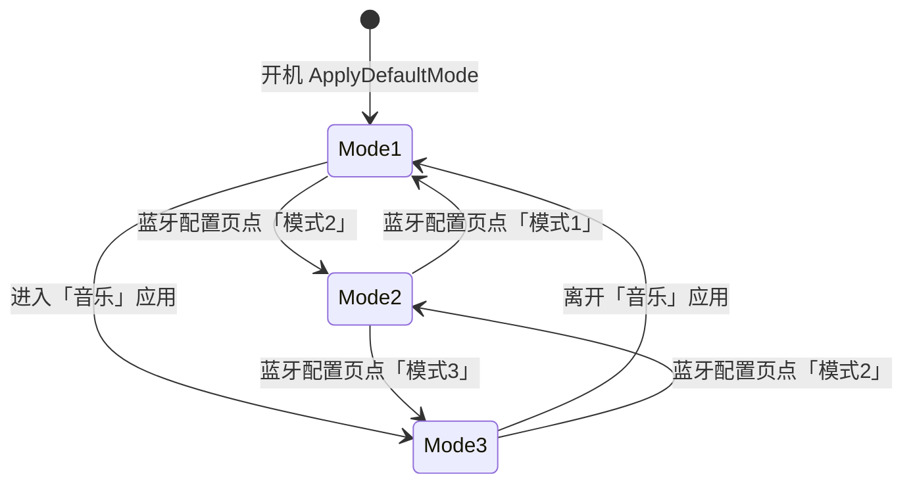

# 蓝牙音频模块模式切换说明

> **版本**：与固件 `bluetooth_screen` / `music_screen` / `xingzhi-395` 当前实现对齐  
> **适用对象**：使用者、固件开发者、硬件联调  
> **设备型号**：xingzhi-395（独立蓝牙音频芯片 + ESP32-P4 经 UART 控制）

本文档说明设备如何通过 **UART（115200）** 向蓝牙音频芯片发送 AT 指令，在三种工作模式之间切换，以及各 UI 页面、开机流程在何时触发切换。

---

## 目录

1. [三种模式是什么](#1-三种模式是什么)
2. [谁在什么时候会切换模式](#2-谁在什么时候会切换模式)
3. [模式 2 的子功能（通话 / 音乐）](#3-模式-2-的子功能通话--音乐)
4. [音乐页附加 AT 命令（模式 3）](#4-音乐页附加-at-命令模式-3)
5. [开发者：代码位置与任务](#5-开发者代码位置与任务)
6. [协议细节](#6-协议细节)
7. [日常使用建议](#7-日常使用建议)
8. [已知注意点](#8-已知注意点)

---

## 1. 三种模式是什么

| 模式 | 通俗说法 | 典型用途 | 发给芯片的指令（顺序） | 代码枚举 |
|:---:|:---|:---|:---|:---|
| **模式 1** | 普通接收模式 | 开机默认；日常待机；退出音乐页后自动回到这里 | `AT+RX=2` → 等待 700ms → `AT+MODE=1` | `BtMode::kMode1` |
| **模式 2** | 配对 / 发射模式 | 在「蓝牙配置」里扫描、连接耳机或音箱；连上后可切通话或音乐子模式 | `AT+TX=1` → 等待 700ms → `AT+MODE=2` | `BtMode::kMode2` |
| **模式 3** | 蓝牙音箱模式 | 手机蓝牙连接本设备，用手机音乐 App 播放；对应首页「音乐」应用 | `AT+RX=1` → 等待 700ms → `AT+MODE=3` | `BtMode::kMode3` |

**记忆口诀：**

- **模式 1**：默认、安静待着  
- **模式 2**：主动去连别的蓝牙设备（配对页）  
- **模式 3**：手机连我，我当音箱放歌（音乐页）



---

## 2. 谁在什么时候会切换模式

全工程内，**只有以下位置会发送 `AT+MODE=1/2/3`**。其它 display 页面（聊天、OpenClaw、相机等）不会切换蓝牙模式。

| 触发场景 | 对用户的表现 | 切到哪个模式 | 是否自动切回 | 相关代码 |
|:---|:---|:---:|:---|:---|
| **设备开机** | 上电后蓝牙进入默认状态 | **模式 1** | 否 | `xingzhi-395.cc` → `InitializeBTAudio()` → `BluetoothScreen::ApplyDefaultMode()` |
| **打开「蓝牙配置」** | 进入页面，界面反映当前模式 | **不变** | — | `bluetooth_screen.cc` → `LifecycleCallback(LOAD)` 仅注册 UART 回调 |
| **蓝牙配置 · 点「模式1/2/3」** | 状态栏显示「切换模式 x…」 | 用户所选 | 否 | `on_mode_btn_clicked` → `send_mode_command` → `mode_cmd_task` |
| **离开「蓝牙配置」** | 返回主页 | **不变** | — | `LifecycleCallback(UNLOAD)` 仅注销回调 |
| **打开「音乐」应用** | 界面提示蓝牙音箱模式 | **模式 3** | 离开音乐页时切回 | `music_screen.cc` → `LifecycleCallback(LOAD)` → `switch_to_mode3_task` |
| **离开「音乐」应用** | 返回主页 | **模式 1** | 否 | `music_screen.cc` → `LifecycleCallback(UNLOAD)` → `switch_to_mode1_task` |
| **点「复位蓝牙」** | 蓝牙芯片断电再上电 | 软件记为「无模式」 | 需用户重新选模式 | `bt_reset_task`（仅蓝牙配置页） |

### 不会切模式的相关行为

| 行为 | 说明 |
|:---|:---|
| `home_screen` 启动蓝牙配置 | 只 `Create()` 页面并转发 `LifecycleCallback`，不发 `AT+MODE` |
| 离开蓝牙配置返回主页 | 硬件保持离开前的模式（见 `on_screen_unloaded` 注释） |
| 模式 2 下点「通话模式」「音乐模式」 | 改的是连接后的音频配置，**不是** `AT+MODE`（见下一节） |

---

## 3. 模式 2 的子功能（通话 / 音乐）

在 **模式 2 且已连接蓝牙设备** 时，「蓝牙配置」页提供扫描与子模式按钮。这些操作 **不会** 切换 `AT+MODE=1/2/3`。

| 操作 | 前置条件 | AT 指令 | 代码 |
|:---|:---|:---|:---|
| **扫描设备** | 当前为模式 2 | `AT+INQUIRING` | `on_scan_clicked` |
| **通话模式** | 模式 2 且已连接 | `AT+PP=1` → `AT+BTSCO=1` | `call_mode_task` |
| **音乐模式** | 模式 2 且已连接 | `AT+BTSCO=0` → `AT+PP=1` | `music_mode_task` |

模式 2 面板还支持从列表中选择设备发起连接（具体连接 AT 由 `bluetooth_screen` 内 UART 交互处理）。

---

## 4. 音乐页附加 AT 命令（模式 3）

进入 **模式 3** 后，`music_screen` 通过 UART 控制播放，并解析手机回传的 JSON（歌名、歌词等）。

| 用户操作 | AT 指令 |
|:---|:---|
| 上一曲 | `AT+PREV` |
| 下一曲 | `AT+NEXT` |
| 播放 | `AT+MPLAY=1` |
| 暂停 | `AT+MPAUSE=1` |
| 音量加 / 减 | `AT+VOLUP` / `AT+VOLDOWN` |

手机 JSON 示例（RX 回调解析）：

```json
{"type":"song",   "data":"人间共鸣-李健"}
{"type":"lyrics", "data":"人间共鸣 - 李健"}
```

---

## 5. 开发者：代码位置与任务

### 5.1 文件索引

| 主题 | 文件 |
|:---|:---|
| 蓝牙配置 UI、三种模式切换、扫描/连接 | `main/display/screen/bluetooth_screen/bluetooth_screen.cc` |
| 开机默认模式 1 | `main/boards/xingzhi-395/xingzhi-395.cc` → `InitializeBTAudio()` |
| 音乐页进出切模式 3 / 1 | `main/display/screen/music_screen/music_screen.cc` |
| UART 封装 | `main/boards/common/SimpleUart.hpp` |
| 蓝牙芯片电源 | `main/boards/common/IOExpander.hpp` → `Pin::BT_POWER` |
| 首页入口 | `main/display/screen/home_screen/home_screen.cc` |

### 5.2 调用关系

```
SimpleUart (UART_NUM_2, 115200)
    ↑
    ├── 开机: xingzhi-395.cc::InitializeBTAudio()
    │         └── BluetoothScreen::ApplyDefaultMode()
    │               └── send_mode_command(kMode1) → task "bt_mode_cmd"
    │
    ├── 蓝牙配置: bluetooth_screen.cc
    │         ├── 模式按钮 → send_mode_command → "bt_mode_cmd"
    │         ├── 复位蓝牙 → "bt_reset" (IOExpander BT_POWER)
    │         ├── 扫描 → AT+INQUIRING (仅模式 2)
    │         └── 通话/音乐子模式 → "bt_call_mode" / "bt_music_mode"
    │
    └── 音乐页: music_screen.cc
              ├── 进入 → "mus_mode3" (模式 3)
              └── 离开 → "mus_mode1" (模式 1)
```

### 5.3 FreeRTOS 任务

| 任务名 | 栈大小 | 作用 |
|:---|:---:|:---|
| `bt_mode_cmd` | 4096 | 发送 `AT+MODE=1/2/3`（含 700ms 间隔） |
| `mus_mode3` | 4096 | 音乐页进入 → 模式 3 |
| `mus_mode1` | 4096 | 音乐页离开 → 模式 1 |
| `bt_reset` | 4096 | 蓝牙芯片电源复位 |
| `bt_call_mode` | 4096 | 模式 2 下切通话子配置 |
| `bt_music_mode` | 4096 | 模式 2 下切音乐子配置 |

### 5.4 内部状态变量

| 变量 | 文件 | 含义 |
|:---|:---|:---|
| `s_active_mode` | `bluetooth_screen.cc` | 软件记录当前模式，用于配置页 UI 高亮 |
| `s_conn_state` | `bluetooth_screen.cc` | 模式 2 连接状态（空闲/扫描中/连接中/已连接） |
| `s_screen_active` | 各 screen | 防止页面销毁后 UART 回调写野指针 |

---

## 6. 协议细节

### 6.1 模式切换命令表

| 目标模式 | 第一条 | 间隔 | 第二条 |
|:---:|:---|:---:|:---|
| 1 | `AT+RX=2\r\n` | 700 ms | `AT+MODE=1\r\n` |
| 2 | `AT+TX=1\r\n` | 700 ms | `AT+MODE=2\r\n` |
| 3 | `AT+RX=1\r\n` | 700 ms | `AT+MODE=3\r\n` |

### 6.2 开机初始化

板级 `InitializeBTAudio()` 流程：

1. `SimpleUart::begin(BT_AUDIO_TX_PIN, BT_AUDIO_RX_PIN, 115200, UART_NUM_2)`
2. `BluetoothScreen::ApplyDefaultMode()`  
   - 设置 `s_active_mode = kMode1`  
   - 后台 task 发送模式 1 指令（UI 未启动时 `post_status` 会因守卫而 no-op，安全）

### 6.3 UART 回调互斥

`bluetooth_screen` 与 `music_screen` 进入时都会 `registerCallback`；**离开时必须** `registerCallback(empty)`，避免屏幕销毁后仍向 LVGL 写数据。

---

## 7. 日常使用建议

| 你想… | 应该… |
|:---|:---|
| 用手机连设备放歌 | 打开首页 **「音乐」**（自动进入模式 3） |
| 配对耳机或音箱 | 打开 **「蓝牙配置」** → 点 **模式 2** → 扫描 → 连接 |
| 用完音乐回到默认 | 从音乐页返回即可（自动回到模式 1） |
| 设备刚开机 | 无需操作，已是模式 1 |
| 蓝牙异常、需要烧录蓝牙固件 | 仅在 **蓝牙配置** 中点 **「复位蓝牙」**（平时勿点） |

---

## 8. 已知注意点

### 8.1 UI 状态与硬件不同步

`music_screen` 切换模式时 **不会更新** `bluetooth_screen` 的 `s_active_mode`。

**现象：** 用户从音乐页（硬件已是模式 3）再进入蓝牙配置，界面可能仍高亮「模式 1」，直到用户再次点击模式按钮。

**改进方向（可选）：** 在 `music_screen` 切模式时同步更新 `BluetoothScreen` 内部状态，或在进入蓝牙配置页时根据实际场景刷新 UI。

### 8.2 离开页面不等于恢复模式

只有 **音乐页 unload** 和 **开机默认** 会自动切换 `AT+MODE`；离开蓝牙配置页 **不会** 改变硬件模式（`on_screen_unloaded` 故意保留 `s_active_mode`）。

### 8.3 全工程 `AT+MODE` 发送点汇总

| 位置 | 模式 |
|:---|:---|
| `BluetoothScreen::ApplyDefaultMode()` | 1 |
| `bluetooth_screen` 模式按钮 | 1 / 2 / 3 |
| `music_screen` LOAD | 3 |
| `music_screen` UNLOAD | 1 |

无其它页面会发送 `AT+MODE`。

---

## 附录：相关头文件声明

```cpp
// bluetooth_screen.h
//   模式1: AT+RX=2 -> AT+MODE=1  (接收模式)
//   模式2: AT+TX=1 -> AT+MODE=2  (发射/配对模式)
//   模式3: AT+RX=1 -> AT+MODE=3  (音乐接收模式)
class BluetoothScreen {
public:
    static void ApplyDefaultMode();  // 开机默认模式 1
    static void LifecycleCallback(screen_lifecycle_event_t event);
};
```

```cpp
// music_screen.h — 进入 LOAD 切模式 3，UNLOAD 切回模式 1
class MusicScreen {
public:
    static void LifecycleCallback(screen_lifecycle_event_t event);
};
```
