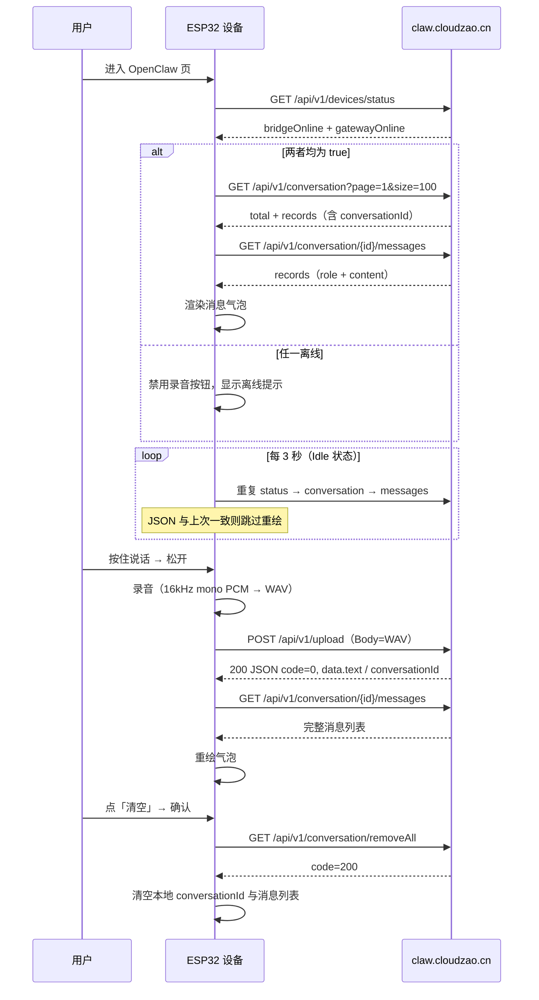

# OpenClaw 设备端 HTTP 接口规范

> **版本**：与固件 `openclaw_screen` 当前实现对齐  
> **适用对象**：后端开发者、联调测试  
> **设备型号**：xingzhi-395（OpenClaw 应用页）  
> **固件源码**：`main/display/screen/openclaw_screen/openclaw_screen.cc`

本文档描述 ESP32 设备 **OpenClaw** 页面与 **龙虾云服务**（`http://claw.cloudzao.cn`）之间的 HTTP 接口。设备不直接访问上游 AI，所有请求经云端中转。

---

## 目录

1. [整体交互流程](#1-整体交互流程)
2. [服务基础配置](#2-服务基础配置)
3. [设备身份（X-Device-Id）](#3-设备身份x-device-id)
4. [通用约定](#4-通用约定)
5. [GET /api/v1/devices/status](#5-get-apiv1devicesstatus)
6. [GET /api/v1/conversation](#6-get-apiv1conversation)
7. [GET /api/v1/conversation/{id}/messages](#7-get-apiv1conversationidmessages)
8. [POST /api/v1/upload](#8-post-apiv1upload)
9. [GET /api/v1/conversation/removeAll](#9-get-apiv1conversationremoveall)
10. [设备端 UI 行为](#10-设备端-ui-行为)
11. [WAV 音频格式](#11-wav-音频格式)
12. [错误处理与排查](#12-错误处理与排查)
13. [后端实现检查清单](#13-后端实现检查清单)
14. [curl 测试示例](#14-curl-测试示例)

---

## 1. 整体交互流程



**要点：**

- 进入页面前设备须已**激活**；未激活时弹出拦截弹窗，不发起业务请求。
- 仅当 `bridgeOnline` **且** `gatewayOnline` 均为 `true` 时，才拉取会话并允许录音。
- 上传成功后设备**立即**拉取消息列表刷新 UI，不再单独展示本地「正在处理」占位气泡。
- 后台每 **3 秒**自动静默刷新；录音或上传进行中跳过刷新。

---

## 2. 服务基础配置

| 配置项 | 固件值 | 说明 |
|:---|:---|:---|
| 服务器地址 | `http://claw.cloudzao.cn` | 写死在固件，不可在设备端修改 |
| API 前缀 | `/api/v1/` | 所有路径均在此前缀下 |
| 协议 | HTTP | 固件未实现 HTTPS |
| 连接 | `Connection: close` | GET / POST 上传使用短连接 |

**完整 URL 示例：**

```
http://claw.cloudzao.cn/api/v1/devices/status
http://claw.cloudzao.cn/api/v1/conversation?page=1&size=100
http://claw.cloudzao.cn/api/v1/conversation/{conversationId}/messages?page=1&size=100
http://claw.cloudzao.cn/api/v1/upload
http://claw.cloudzao.cn/api/v1/conversation/removeAll
```

---

## 3. 设备身份（X-Device-Id）

每个请求的 HTTP Header 中携带：

```http
X-Device-Id: aa:bb:cc:dd:ee:ff
```

- 值为 WiFi STA **MAC 地址**，格式 `xx:xx:xx:xx:xx:xx`（小写十六进制，冒号分隔）
- 来源：`SystemInfo::GetMacAddress()`
- 服务端应以此标识设备，用于会话隔离与状态查询

> **注意**：旧版文档使用 `deviceid` 头，当前固件已统一为 **`X-Device-Id`**。

---

## 4. 通用约定

### 4.1 成功码（两套）

固件对不同类型接口使用不同的 `code` 判断逻辑：

| 接口类型 | 成功条件 |
|:---|:---|
| status / conversation / messages / removeAll | HTTP **200** 且 JSON `code == **200**` |
| upload | HTTP **200** 且 JSON `code == **0**`（或 body 以 `OK ` 开头的纯文本） |

### 4.2 响应 JSON 骨架

```json
{
  "code": 200,
  "message": "可选说明",
  "data": { }
}
```

### 4.3 分页参数

会话列表与消息列表均固定传：

```
page=1&size=100
```

设备端不做翻页，一次最多加载 100 条。

---

## 5. GET /api/v1/devices/status

检查设备对应龙虾插件与网关是否在线。**所有业务操作的前置条件。**

### 请求

```http
GET /api/v1/devices/status HTTP/1.1
Host: claw.cloudzao.cn
Accept: application/json
Connection: close
X-Device-Id: aa:bb:cc:dd:ee:ff
```

### 响应

```json
{
  "code": 200,
  "data": {
    "bridgeOnline": true,
    "gatewayOnline": true
  }
}
```

| 字段 | 类型 | 说明 |
|:---|:---|:---|
| `bridgeOnline` | boolean | 龙虾**插件**是否在线 |
| `gatewayOnline` | boolean | **龙虾网关**是否在线 |

### 设备端判定

| bridgeOnline | gatewayOnline | 设备行为 |
|:---:|:---:|:---|
| true | true | 服务可用，继续拉会话与消息，允许录音 |
| false | false | 提示「龙虾插件不在线，龙虾不在线」，禁用录音 |
| false | true | 提示「龙虾插件不在线」，禁用录音 |
| true | false | 提示「龙虾不在线」，禁用录音 |

---

## 6. GET /api/v1/conversation

获取当前设备下的会话列表，用于解析 `conversationId`。

### 请求

```http
GET /api/v1/conversation?page=1&size=100 HTTP/1.1
Host: claw.cloudzao.cn
Accept: application/json
Connection: close
X-Device-Id: aa:bb:cc:dd:ee:ff
```

### 响应

```json
{
  "code": 200,
  "data": {
    "total": 2,
    "records": [
      { "conversationId": "conv-001" },
      { "conversationId": "conv-002" }
    ]
  }
}
```

| 字段 | 类型 | 说明 |
|:---|:---|:---|
| `total` | number | 会话总数 |
| `records` | array | 会话记录列表 |

### conversationId 选取规则（固件逻辑）

| total | 行为 |
|:---:|:---|
| `0` | 不设置 `conversationId`，上传时不带 `conversationId` 头 |
| `1` | 取 `records[0].conversationId` |
| `> 1` | 取 **`records` 最后一项**的 `conversationId`（`records[record_count - 1]`） |

> 多会话场景下设备始终跟随**最新一条**会话记录。

---

## 7. GET /api/v1/conversation/{id}/messages

拉取指定会话的消息列表，用于页面渲染与上传后刷新。

### 请求

```http
GET /api/v1/conversation/conv-002/messages?page=1&size=100 HTTP/1.1
Host: claw.cloudzao.cn
Accept: application/json
Connection: close
X-Device-Id: aa:bb:cc:dd:ee:ff
```

当 `conversationId` 为空时，设备**跳过**此请求。

### 响应

```json
{
  "code": 200,
  "data": {
    "records": [
      { "role": "user", "content": "今天天气怎么样？" },
      { "role": "assistant", "content": "今天晴，25°C。" }
    ]
  }
}
```

| 字段 | 类型 | 说明 |
|:---|:---|:---|
| `records` | array | 消息列表，按时间顺序 |
| `records[].role` | string | `user` 为用户消息，其它值（含 `assistant`）为助手消息 |
| `records[].content` | string | 消息正文；空字符串的记录被忽略 |

### 设备端渲染

| role | 气泡位置 | 说明 |
|:---|:---|:---|
| `user` | 右侧（绿色） | 用户语音转写或文本 |
| 非 `user`（如 `assistant`） | 左侧（灰色） | 龙虾回复 |

列表最多保留 **50** 条气泡（超出删最旧）。

---

## 8. POST /api/v1/upload

上传按住说话录制的 WAV 音频，触发 ASR 与对话流程。

### 请求

```http
POST /api/v1/upload HTTP/1.1
Host: claw.cloudzao.cn
Content-Type: audio/wav
Connection: close
X-Device-Id: aa:bb:cc:dd:ee:ff
conversationId: conv-002

<raw WAV bytes>
```

| Header | 必填 | 说明 |
|:---|:---:|:---|
| `Content-Type` | 是 | 固定 `audio/wav` |
| `X-Device-Id` | 是 | 设备 MAC |
| `conversationId` | 否 | 仅当设备已有会话 ID 时携带；**首次对话（total=0 或清空后）不带** |

- Body 为 **原始 WAV 字节**（44 字节头 + PCM），**不是** `multipart/form-data`。
- 建议服务端在 **30 秒内**返回。

### 成功响应

**方式一（推荐，JSON）：**

```json
{
  "code": 0,
  "data": {
    "text": "今天天气怎么样？",
    "conversationId": "conv-002"
  }
}
```

| 字段 | 类型 | 说明 |
|:---|:---|:---|
| `data.text` | string | ASR 识别文本（可选，设备以上传后消息列表为准） |
| `data.conversationId` | string | 会话 ID；若返回非空，设备会更新本地 `s_conversation_id` |

**方式二（兼容纯文本）：**

```
OK
```

Body 以 `OK ` 开头（注意空格）也视为成功，但无法携带 `conversationId`。

### 上传后设备行为

1. 若响应含 `conversationId`，更新本地会话 ID  
2. 调用 `GET .../messages` 拉取完整消息列表并重绘 UI  
3. 若拉取失败，状态栏显示「刷新消息失败」

### 失败响应

HTTP 非 200，或 JSON `code != 0` 且 body 不以 `OK ` 开头 → 状态栏显示「上传失败: …」。

---

## 9. GET /api/v1/conversation/removeAll

清空当前设备下的全部会话。设备 Header 按钮「清空」确认后触发。

### 请求

```http
GET /api/v1/conversation/removeAll HTTP/1.1
Host: claw.cloudzao.cn
Accept: application/json
X-Device-Id: aa:bb:cc:dd:ee:ff
```

> 固件使用 HTTP **GET** 发起此请求（非 DELETE）。

### 成功响应

```json
{
  "code": 200,
  "message": "ok"
}
```

### 设备端行为

- 清空本地 `s_conversation_id`
- 清空消息列表 UI
- 后续上传**不再**携带 `conversationId` 头，等同新会话

---

## 10. 设备端 UI 行为

### 10.1 页面生命周期

| 事件 | 行为 |
|:---|:---|
| 进入页面（已激活） | 检查 status → 拉 conversation → 拉 messages；启动 3s 自动刷新定时器 |
| 未激活 | 全屏拦截弹窗，禁止操作 |
| 离开页面 | 停止定时器；清空静态状态；恢复唤醒词检测 |

### 10.2 自动刷新

- 间隔：**3000 ms**
- 条件：页面存活、已激活、状态为 `Idle`（非录音/上传）
- 优化：对比 `RefreshSnapshot`（服务状态、conversationId、消息 JSON 原文），**数据未变不重绘 UI**

### 10.3 录音交互

| 阶段 | 用户操作 | 设备行为 |
|:---|:---|:---|
| 空闲 | 按住底部按钮 | 开始录音，按钮变红，显示「已录 X.X 秒」 |
| 录音中 | 松开按钮 | 停止录音，进入上传 |
| 上传中 | — | 按钮置灰，显示「上传中…」 |
| 完成 | — | 拉取消息列表刷新；或显示错误 |

**录音限制：**

- 最短 **300 ms**，低于此不上传
- 最长 **60 秒**
- 与主对话（Connecting / Listening / Speaking）互斥时拒绝录音

### 10.4 清空会话

Header 右上角「清空」→ 确认对话框 → `removeAll` → 本地会话 ID 置空。

---

## 11. WAV 音频格式

设备上传的 WAV 由固件在 PCM 前拼接标准 44 字节 RIFF 头：

| 参数 | 值 |
|:---|:---|
| 采样率 | 16000 Hz |
| 声道 | 1（mono） |
| 位深 | 16 bit PCM |
| 编码 | `fmt` chunk format = 1（PCM） |
| 最大时长 | 60 秒（约 1.92 MB PCM + 44 B 头） |
| 最短有效 | 300 ms |

双声道输入时固件只保留左声道再封装。

---

## 12. 错误处理与排查

| 现象 | 可能原因 |
|:---|:---|
| 「龙虾插件不在线」 | `bridgeOnline == false` |
| 「龙虾不在线」 | `gatewayOnline == false` |
| 「检查在线状态失败」 | status 接口网络错误或 `code != 200` |
| 「加载会话失败」 | conversation 接口异常 |
| 「加载消息失败」 | messages 接口异常或 JSON 解析失败 |
| 「上传失败」 | upload HTTP 非 200 或 `code != 0` |
| 「刷新消息失败」 | 上传成功但 messages 拉取失败 |
| 「录音太短，再试一次」 | 按住不足 300 ms |
| 「请先结束当前对话」 | 设备正在 Connecting/Listening/Speaking |
| 「龙虾服务不可用」 | 服务离线时尝试录音或清空 |

**联调建议：**

1. 先用 curl 带 `X-Device-Id` 测通 status，确认两个 online 均为 true  
2. 确认 `code` 字段：查询类接口用 **200**，upload 用 **0**  
3. 上传用 raw body + `Content-Type: audio/wav`，不要用 multipart  
4. 清空后验证下一次 upload **不带** `conversationId` 头

---

## 13. 后端实现检查清单

```
[ ] 所有接口从 X-Device-Id 识别设备，按设备隔离数据
[ ] GET /devices/status 返回 bridgeOnline、gatewayOnline
[ ] GET /conversation 返回 total + records[].conversationId
[ ] GET /conversation/{id}/messages 返回 records[].role + content
[ ] role 使用 "user" / "assistant"（设备将非 user 均渲染为左侧气泡）
[ ] POST /upload 接受 raw WAV，Content-Type: audio/wav
[ ] upload 成功返回 code=0，data 含 conversationId（新会话时必填）
[ ] 已有会话时设备会带 conversationId 请求头
[ ] GET /conversation/removeAll 清空该设备全部会话，返回 code=200
[ ] 查询类接口成功码为 200，与 upload 的 0 区分
[ ] 建议在 30s 内完成 upload 响应
```

---

## 14. curl 测试示例

将 `DEVICE_ID` 替换为实际 MAC（如 `aa:bb:cc:dd:ee:ff`）。

### 检查在线状态

```bash
curl -s "http://claw.cloudzao.cn/api/v1/devices/status" \
  -H "Accept: application/json" \
  -H "X-Device-Id: DEVICE_ID"
```

### 拉取会话列表

```bash
curl -s "http://claw.cloudzao.cn/api/v1/conversation?page=1&size=100" \
  -H "Accept: application/json" \
  -H "X-Device-Id: DEVICE_ID"
```

### 拉取消息

```bash
curl -s "http://claw.cloudzao.cn/api/v1/conversation/CONV_ID/messages?page=1&size=100" \
  -H "Accept: application/json" \
  -H "X-Device-Id: DEVICE_ID"
```

### 上传 WAV（新会话，不带 conversationId）

```bash
curl -s -X POST "http://claw.cloudzao.cn/api/v1/upload" \
  -H "Content-Type: audio/wav" \
  -H "X-Device-Id: DEVICE_ID" \
  --data-binary @recording.wav
```

### 上传 WAV（已有会话）

```bash
curl -s -X POST "http://claw.cloudzao.cn/api/v1/upload" \
  -H "Content-Type: audio/wav" \
  -H "X-Device-Id: DEVICE_ID" \
  -H "conversationId: CONV_ID" \
  --data-binary @recording.wav
```

### 清空全部会话

```bash
curl -s "http://claw.cloudzao.cn/api/v1/conversation/removeAll" \
  -H "Accept: application/json" \
  -H "X-Device-Id: DEVICE_ID"
```

---

## 附录：固件常量对照

| 常量 | 值 |
|:---|:---|
| `kDefaultServerUrl` | `http://claw.cloudzao.cn` |
| `kDeviceStatusPath` | `/api/v1/devices/status` |
| `kConversationListPath` | `/api/v1/conversation?page=1&size=100` |
| `kUploadPath` | `/api/v1/upload` |
| `kMessagesPathFmt` | `/api/v1/conversation/%s/messages?page=1&size=100` |
| `kRemoveAllPath` | `/api/v1/conversation/removeAll` |
| `kRefreshIntervalMs` | `3000` |
| `kMinRecordMs` | `300` |
| `kMaxRecordSeconds` | `60` |
| `kMaxMessages` | `50` |
